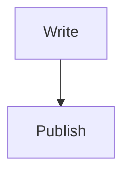

# Markdown guide

A single note that exercises **every** kind of content the site renders. See also
[[Callout gallery]] and [[Code samples]]. Back to [[Welcome]].

## Headings

The six heading levels each get their own Catppuccin colour:

## Heading level 2
### Heading level 3
#### Heading level 4
##### Heading level 5
###### Heading level 6

## Text formatting

Regular text with **bold**, *italic*, ***bold italic***, ~~strikethrough~~, and
`inline code`. Here's a hard break —
this sits on a new line. You can also escape characters like \*literal asterisks\*.

A footnote-free paragraph with a longer measure so you can judge the body font
(Inter) and the comfortable reading width. Lorem ipsum dolor sit amet, consectetur
adipiscing elit, sed do eiusmod tempor incididunt ut labore et dolore magna aliqua.

## Links

- External: [Obsidian](https://obsidian.md) and an autolink isn't auto, but
  <https://example.com> works.
- Internal wikilink: [[Code samples]]
- Aliased wikilink: [[Code samples|see the code examples]]
- Heading link: [[Callout gallery#Warning family]]
- Broken link (intentional): [[A note that does not exist]]

## Lists

Unordered, with nesting:

- Fruit
  - Apple
  - Pear
    - Conference
- Vegetables

Ordered:

1. First
2. Second
   1. Second-A
   2. Second-B
3. Third

Task list:

- [x] Write the generator
- [x] Add a polish pass
- [ ] Take over the world

## Blockquotes

> A normal blockquote.
>
> > And a nested one inside it.

## Table

Markdown tables, with column alignment:

| Feature        | Status      | Notes                    |
|:---------------|:-----------:|-------------------------:|
| Wikilinks      | ✅ done      | aliases + headings       |
| Callouts       | ✅ done      | see the gallery          |
| Math           | ✅ done      | KaTeX, see below         |

## Horizontal rule

---

## Image embed

An embedded image scales to the column width:

![[diagram.svg]]

## Inline code & symbols

Press `Ctrl`+`C` to copy. Some symbols: → ← ⌘ ¶ © — “curly quotes” and an
em-dash—like this.

## Math

Inline math uses single dollar signs: $e^{i\pi}+1=0$

Display math uses double dollar signs on their own lines:

$$\int_0^1 x^2\,dx = \tfrac{1}{3}$$

## Diagrams

Mermaid diagrams are rendered client-side from fenced code blocks:

